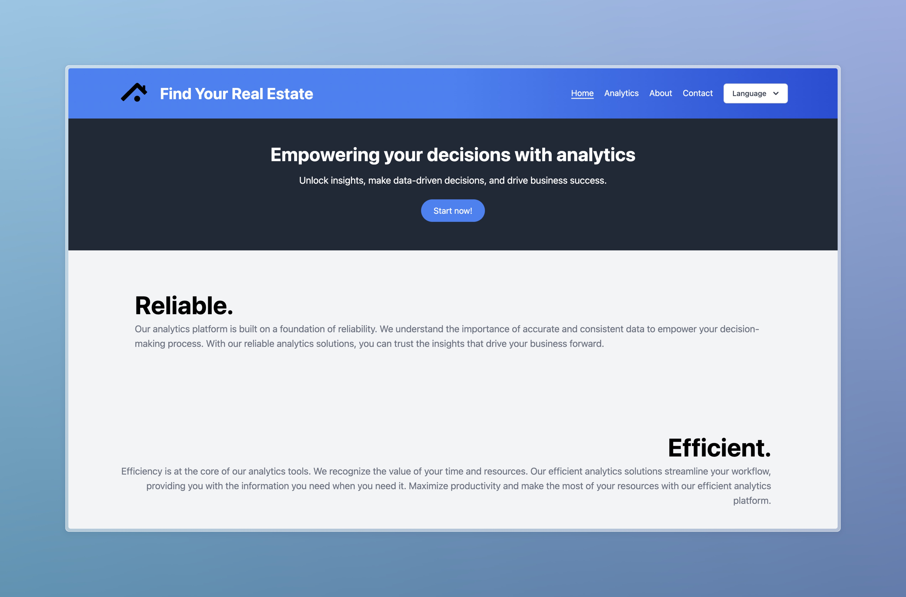

# Fyre

> A simple Django project to explore Real Estate data and publish it to the web using Vercel.

[](https://fyre.vercel.app/)

## Getting Started

### Prerequisites

- Python 3.9 (Not higher)
- Pip

### Install

To install the project, start by cloning the repository:

```bash
git clone https://github.com/MorganKryze/Fyre.git
```

Then install the dependencies:

```bash
pip install -r requirements.txt
```

That's it! You're ready to go.

### Use

To run the project, just run the following command:

```bash
python manage.py runserver
```

To host the project on Vercel, you'll need to create a new project and link it to your repository. Then it should be good to go!

## Built With

- [Django](https://www.djangoproject.com/) - The web framework used
- [Vercel](https://vercel.com/) - The hosting platform used

## Authors

- [**Morgan Kryze**](https://github.com/MorganKryze)
- [**MailiTurong**](https://github.com/MailiTruong)
- [**sheesh3218**](https://github.com/sheesh3218)

## License

This project is licensed under the MIT License - see the [LICENSE](LICENSE) file for details.
